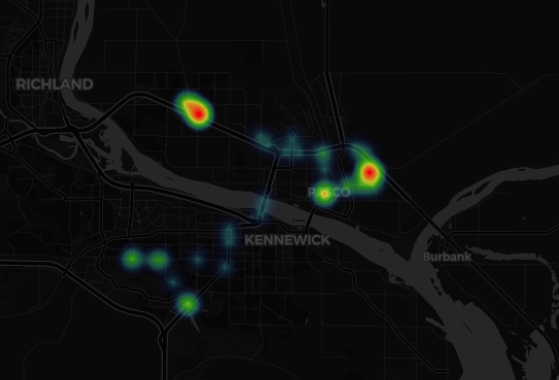

[](https://github.com/vdbg/tile-influx/issues)
[](https://raw.githubusercontent.com/vdbg/tile-influx/main/LICENSE)


# Tile-influx

Allows for importing data from [Tile](https://www.tile.com/) to [InfluxDB](https://www.influxdata.com/) v2.


## Requirements

- [Tile](https://www.tile.com/) credentials associated with active Tile(s) devices.
- A device with either [Docker](https://www.docker.com/) or Python 3.11+ installed.
- [InfluxDB](https://en.wikipedia.org/wiki/InfluxDB) v2 installed on this device or another device, and a bucket created in influxDB.

## Setup

### With Docker

Dependency: Docker installed.

1. Download and run the Docker image: `sudo docker run --name tile-influx -v config.toml:/app/config.toml vdbg/tile-influx:latest`
2. Copy the template config file from the image: `sudo docker cp tile-influx:/app/template.config.toml config.toml`
3. Edit `config.toml` by following the instructions in the file
4. Start the container again to verify the settings are correct: `sudo docker start tile-influx -i`
5. Once the settings are finalized, `Ctrl-C` to stop the container, `sudo docker container rm tile-influx` to delete it
6. Start the container with the final settings:

```
sudo docker run \
  -d \
  --name tile-influx \
  -v /path_to_your/config.toml:/app/config.toml \
  --memory=100m \
  --pull=always \
  --restart=always \
  vdbg/tile-influx:latest
```

### Without Docker

Dependency: Python 3.11+ and pip3 installed. `sudo apt-get install python3-pip` if missing on raspbian.

1. Git clone this repository and cd into directory
2. `cp template.config.toml config.toml`
3. Edit file `config.toml` by following the instructions in the file
4. `pip3 install -r requirements.txt`
5. `python3 main.py` or `./main.py`

## Grafana


To get a dashboard similar to the below one, download the [template](grafana/dashboard.json), and replace the `Tile_1` ... `Tile_4` placeholders with names of Tile devices creating a dashboard from the template. Delete extra panels if fewer than 4 devices, duplicate one if more.


